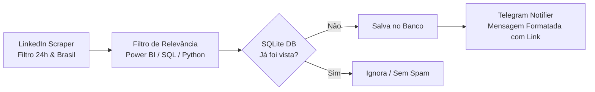

<div align="center">

# 🎯 Monitor de Vagas de Dados (LinkedIn ➔ Telegram Bot)

[](https://python.org)
[](https://core.telegram.org/bots)
[](https://sqlite.org)
[](https://www.crummy.com/software/BeautifulSoup/)
[](LICENSE)

*Robô autônomo em Python para monitoramento, filtragem inteligente e notificação em tempo real de vagas de **Power BI, SQL, Python e Análise de Dados** no LinkedIn com segmentação por modalidade e **Easy Apply (Candidatura Simplificada)**.*

</div>

---

## 📌 Visão Geral

Este projeto automatiza a busca diária por oportunidades no mercado de dados no Brasil. O robô faz a varredura contínua de novas postagens no LinkedIn (últimas 24h), filtra apenas vagas pertinentes (excluindo posições sênior/fora de escopo), armazena os IDs em um banco de dados local SQLite para evitar repetições e envia notificações instantâneas diretamente para o **Telegram**.



---

## 📂 Segmentação em 6 Categorias

As notificações chegam separadas e identificadas no Telegram:

| Categoria | Modalidade | Tipo de Candidatura |
| :--- | :--- | :--- |
| **🏠 REMOTO \| ⚡ EASY APPLY** | 100% Home Office (Nacional) | Candidatura Simplificada em 1 clique |
| **🏠 REMOTO \| 🌐 SITE DA EMPRESA** | 100% Home Office (Nacional) | Inscrição no Site / Gupy / LinkedIn |
| **🏢🔄 HÍBRIDO \| ⚡ EASY APPLY** | JF, SP, RJ e Florianópolis | Candidatura Simplificada em 1 clique |
| **🏢🔄 HÍBRIDO \| 🌐 SITE DA EMPRESA** | JF, SP, RJ e Florianópolis | Inscrição no Site da Empresa |
| **🏢 PRESENCIAL \| ⚡ EASY APPLY** | JF, SP, RJ e Florianópolis | Candidatura Simplificada em 1 clique |
| **🏢 PRESENCIAL \| 🌐 SITE DA EMPRESA** | JF, SP, RJ e Florianópolis | Inscrição no Site da Empresa |

---

## 🔍 Palavras-chave Monitoradas

* `Power BI`
* `SQL`
* `Python`
* `Analista de Dados`

---

## 🛠️ Tecnologias Utilizadas

- **Linguagem:** Python 3.10+
- **Requisições & Parser:** `requests`, `beautifulsoup4`
- **Banco de Dados:** SQLite3 (deduplicação nativa)
- **Mensageria:** Telegram Bot API
- **Variáveis de Ambiente:** `python-dotenv`
- **CI/CD:** GitHub Actions (para execução programada 24/7)

---

## 🚀 Como Executar Localmente

### 1. Clonar o repositório
```bash
git clone https://github.com/Renanbritto/pesquisa-vagas.git
cd pesquisa-vagas
```

### 2. Criar e ativar o ambiente virtual (opcional, mas recomendado)
```bash
python -m venv venv
# No Windows:
venv\Scripts\activate
# No Linux/Mac:
source venv/bin/activate
```

### 3. Instalar as dependências
```bash
pip install -r requirements.txt
```

### 4. Configurar variáveis de ambiente (`.env`)
Copie o modelo de `.env.example` para `.env`:
```bash
cp .env.example .env
```

Preencha com seu Token e Chat ID do Telegram:
```env
TELEGRAM_BOT_TOKEN=seu_bot_token_aqui
TELEGRAM_CHAT_ID=seu_chat_id_aqui
CHECK_INTERVAL_MINUTES=15
```

> 💡 *Consulte o [GUIA_CONFIGURACAO_TELEGRAM.md](GUIA_CONFIGURACAO_TELEGRAM.md) para ver como criar o bot em 2 minutos via `@BotFather`.*

### 5. Testar a conexão com o Telegram
```bash
python test_telegram.py
```

### 6. Executar o Robô
* **Varredura única imediata:**
  ```bash
  python main.py
  ```

* **Modo Contínuo (executa automaticamente a cada 15 minutos):**
  ```bash
  python main.py --loop
  ```

* **Visualizar estatísticas do banco:**
  ```bash
  python main.py --stats
  ```

---

## 📁 Estrutura de Pastas

```text
pesquisa-vagas/
├── .github/
│   └── workflows/
│       └── vagas_cron.yml         # Automação no GitHub Actions
├── .env.example                   # Modelo de variáveis de ambiente
├── .gitignore                     # Arquivos ignorados pelo Git
├── config.py                      # Parâmetros de busca, filtros e localidades
├── database.py                    # Gerenciador do SQLite (vagas.db)
├── GUIA_CONFIGURACAO_TELEGRAM.md  # Tutorial de configuração do Bot
├── linkedin_scraper.py            # Coletor e parser do LinkedIn
├── main.py                        # Orquestrador das 6 categorias
├── README.md                      # Documentação oficial
├── requirements.txt               # Dependências Python
├── telegram_notifier.py           # Disparador de notificações
└── test_telegram.py               # Validador de credenciais do Telegram
```

---

## ☁️ Automação na Nuvem (GitHub Actions)

O repositório já inclui um fluxo de trabalho em [`.github/workflows/vagas_cron.yml`](.github/workflows/vagas_cron.yml) que pode rodar a cada 1 hora de forma 100% gratuita.

Para ativar no GitHub:
1. Vá nas **Settings** do seu repositório no GitHub.
2. Acesse **Secrets and variables** > **Actions** > **New repository secret**.
3. Adicione:
   - `TELEGRAM_BOT_TOKEN`: seu token do bot.
   - `TELEGRAM_CHAT_ID`: seu chat id.
4. O GitHub Actions executará o robô periodicamente mesmo com o seu computador desligado.

---

## 📄 Licença

Este projeto está sob a licença [MIT](LICENSE).

---

<div align="center">
Desenvolvido por <b>Renan Nocelli Britto</b> • <a href="https://github.com/Renanbritto">GitHub</a>
</div>
