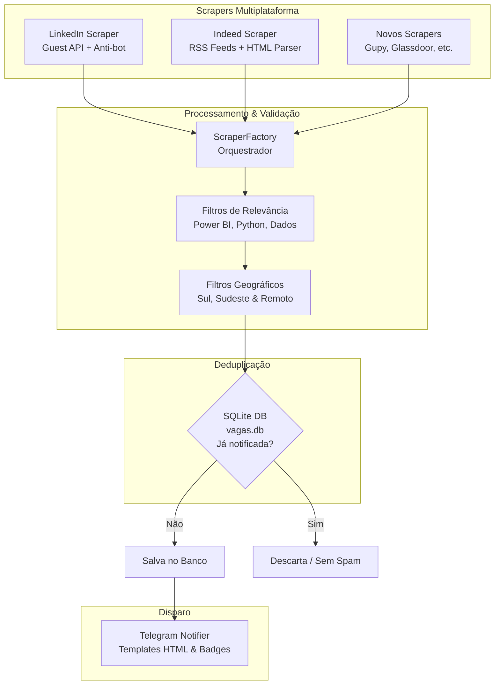

<div align="center">

# 🎯 Pesquisa Vagas (LinkedIn + Indeed ➔ Telegram Bot)

[](https://python.org)
[](https://core.telegram.org/bots)
[](https://linkedin.com)
[](https://br.indeed.com)
[](https://sqlite.org)
[](https://github.com/Renanbritto/pesquisa-vagas/actions)
[](LICENSE)

*Sistema modular e autônomo em Python para monitoramento contínuo, filtragem inteligente e notificação em tempo real de vagas de **Power BI, Python e Análise de Dados** no **LinkedIn** e **Indeed**, segmentadas por modalidade e **Easy Apply (Candidatura Simplificada)**.*

[Visite o Projeto no Portfólio](https://renan-nocelli.vercel.app/projetos/pesquisa-vagas) • [Guia de Contribuição](CONTRIBUTING.md) • [Reportar Bug](https://github.com/Renanbritto/pesquisa-vagas/issues)

</div>

---

## 📌 Visão Geral da Arquitetura

O projeto foi construído seguindo os princípios de **Clean Code**, **Design Patterns (Strategy & Factory)** e arquitetura modular orientada a objetos (`src/` layout):



---

## 📂 6 Categorias de Entrega no Telegram

As oportunidades são entregues com identificação visual clara da categoria e plataforma de origem:

| Categoria | Modalidade | Modelo de Inscrição |
| :--- | :--- | :--- |
| **🏠 REMOTO \| ⚡ EASY APPLY** | 100% Home Office (Nacional) | Candidatura Simplificada em 1 clique |
| **🏠 REMOTO \| 🌐 SITE DA EMPRESA** | 100% Home Office (Nacional) | Inscrição no Site / Gupy / LinkedIn |
| **🏢🔄 HÍBRIDO \| ⚡ EASY APPLY** | JF, SP, RJ e Florianópolis | Candidatura Simplificada em 1 clique |
| **🏢🔄 HÍBRIDO \| 🌐 SITE DA EMPRESA** | JF, SP, RJ e Florianópolis | Inscrição no Site da Empresa |
| **🏢 PRESENCIAL \| ⚡ EASY APPLY** | JF, SP, RJ e Florianópolis | Candidatura Simplificada em 1 clique |
| **🏢 PRESENCIAL \| 🌐 SITE DA EMPRESA** | JF, SP, RJ e Florianópolis | Inscrição no Site da Empresa |

---

## 🏗️ Estrutura do Projeto (`src/` layout)

```text
pesquisa-vagas/
├── .github/
│   ├── ISSUE_TEMPLATE/           # Templates de bugs, features e novos scrapers
│   ├── PULL_REQUEST_TEMPLATE.md  # Template para PRs padronizados
│   └── workflows/
│       ├── ci.yml                # CI de testes automatizados com pytest
│       └── vagas_cron.yml        # Automação agendada na nuvem
├── src/
│   ├── config/
│   │   └── settings.py           # Configurações centralizadas e tipadas
│   ├── database/
│   │   └── repository.py         # Repositório SQLite com deduplicação nativa
│   ├── models/
│   │   └── job.py                # Modelo de dados unificado (Job Dataclass)
│   ├── notifiers/
│   │   ├── base.py               # Interface BaseNotifier
│   │   └── telegram.py           # Disparador Telegram com HTML formatado
│   ├── scrapers/
│   │   ├── base.py               # Classe base abstrata BaseScraper (Strategy Pattern)
│   │   ├── linkedin.py           # Scraper do LinkedIn
│   │   ├── indeed.py             # Scraper do Indeed (RSS + HTML)
│   │   └── factory.py            # Factory para gerenciar e registrar scrapers
│   └── utils/
│       ├── filters.py            # Regras de negócio, filtros de cargo e localidades
│       └── logger.py             # Logger estruturado compatível com UTF-8
├── tests/                        # Suíte de testes unitários com pytest
│   ├── test_database.py
│   ├── test_filters.py
│   ├── test_models.py
│   └── test_scrapers.py
├── .env.example                  # Modelo de variáveis de ambiente
├── .gitignore                    # Regras de proteção de credenciais e caches
├── CODE_OF_CONDUCT.md            # Código de conduta para contribuidores
├── CONTRIBUTING.md               # Guia detalhado de contribuição e GitFlow
├── GUIA_CONFIGURACAO_TELEGRAM.md # Passo a passo para criar o Bot no Telegram
├── main.py                       # CLI / Entrypoint do robô
├── pyproject.toml                # Metadados e configuração de linters/testes
├── requirements.txt              # Dependências de produção
├── requirements-dev.txt          # Dependências de desenvolvimento
└── test_telegram.py              # Validador de conexão do Telegram
```

---

## 🚀 Como Executar Localmente

### 1. Clonar o repositório
```bash
git clone https://github.com/Renanbritto/pesquisa-vagas.git
cd pesquisa-vagas
```

### 2. Criar e ativar o ambiente virtual
```bash
python -m venv venv
# No Windows:
venv\Scripts\activate
# No Linux/Mac:
source venv/bin/activate
```

### 3. Instalar dependências
```bash
# Para produção:
pip install -r requirements.txt

# Para desenvolvimento e testes:
pip install -r requirements-dev.txt
```

### 4. Configurar as variáveis de ambiente
Copie `.env.example` para `.env`:
```bash
cp .env.example .env
```
Preencha com o seu **Token do Bot** e **Chat ID** do Telegram:
```env
TELEGRAM_BOT_TOKEN=seu_bot_token_aqui
TELEGRAM_CHAT_ID=seu_chat_id_aqui
CHECK_INTERVAL_MINUTES=15
```

### 5. Testar a conexão com o Telegram
```bash
python test_telegram.py
```

### 6. Executar o Robô
* **Varredura única em todas as plataformas (LinkedIn + Indeed):**
  ```bash
  python main.py
  ```

* **Buscar apenas no LinkedIn:**
  ```bash
  python main.py --platform linkedin
  ```

* **Buscar apenas no Indeed:**
  ```bash
  python main.py --platform indeed
  ```

* **Modo Contínuo (executa automaticamente a cada 15 minutos):**
  ```bash
  python main.py --loop
  ```

* **Exibir estatísticas do banco de dados:**
  ```bash
  python main.py --stats
  ```

---

## 🧪 Suíte de Testes Automatizados

O projeto conta com cobertura de testes unitários utilizando `pytest`:

```bash
# Executar todos os testes:
pytest

# Executar com relatório de cobertura:
pytest --cov=src
```

---

## 🤝 Como Contribuir

Contribuições são muito bem-vindas! Você pode sugerir melhorias, corrigir bugs ou adicionar suporte a novas plataformas de vagas (como **Gupy**, **Glassdoor**, **Catho**, etc.).

Consulte o nosso **[Guia de Contribuição (CONTRIBUTING.md)](CONTRIBUTING.md)** para entender o fluxo de branches (`main`, `develop`, `feature/`) e como estender a classe `BaseScraper`.

---

## 📄 Licença

Distribuído sob a licença **MIT**. Consulte [`LICENSE`](LICENSE) para mais informações.

---

<div align="center">
Desenvolvido com 💙 por <b>Renan Nocelli Britto</b> • <a href="https://renan-nocelli.vercel.app">Portfólio</a> • <a href="https://github.com/Renanbritto">GitHub</a>
</div>
